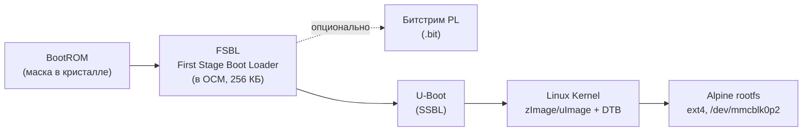

# Сборка корневой файловой системы Alpine Linux 3.20 (armv7) для Xilinx/AMD Zynq-7010

> Практический мануал: от загрузочной цепочки Zynq-7010 до готовой SD-карты с работающим Alpine Linux.
> Проверено по состоянию на **30 августа 2026 г.** Версии пакетов, ядра и U-Boot меняются со временем — сверяйтесь с официальными источниками (раздел 19).

## Оглавление

1. [О документе](#1-о-документе)
2. [Прочитайте перед началом](#2-прочитайте-перед-началом)
3. [Как устроена загрузка Zynq-7010](#3-как-устроена-загрузка-zynq-7010)
4. [Требования](#4-требования)
5. [Разметка SD-карты](#5-разметка-sd-карты)
6. [Способ A: быстрый старт с alpine-minirootfs](#6-способ-a-быстрый-старт-с-alpine-minirootfs)
7. [Способ B: сборка rootfs "с нуля" через apk-tools-static](#7-способ-b-сборка-rootfs-с-нуля-через-apk-tools-static)
8. [Chroot-окружение: qemu-user-static + binfmt_misc](#8-chroot-окружение-qemu-user-static--binfmt_misc)
9. [Настройка системы внутри rootfs](#9-настройка-системы-внутри-rootfs)
10. [Ядро, Device Tree, U-Boot и FSBL](#10-ядро-device-tree-u-boot-и-fsbl)
11. [Перенос rootfs и загрузочных файлов на SD-карту](#11-перенос-rootfs-и-загрузочных-файлов-на-sd-карту)
12. [Параметры и сценарии загрузки U-Boot](#12-параметры-и-сценарии-загрузки-u-boot)
13. [Проверка в QEMU без реальной платы](#13-проверка-в-qemu-без-реальной-платы)
14. [Первая загрузка платы](#14-первая-загрузка-платы)
15. [Кросс-компиляция пользовательских программ и добавление в rootfs](#15-кросс-компиляция-пользовательских-программ-и-добавление-в-rootfs)
16. [Диагностика типичных проблем](#16-диагностика-типичных-проблем)
17. [Автоматизация: единый скрипт сборки rootfs](#17-автоматизация-единый-скрипт-сборки-rootfs)
18. [Что дальше](#18-что-дальше)
19. [Источники и ссылки](#19-источники-и-ссылки)

---

## 1. О документе

Этот мануал описывает полный цикл подготовки корневой файловой системы **Alpine Linux 3.20 (ветка v3.20)** под архитектуру **armv7** для одноплатных решений на базе **Xilinx (ныне AMD) Zynq-7010** (кристалл **XC7Z010**, двухъядерный ARM Cortex-A9) — например, Digilent Zybo Z7-10, MYIR Z-turn Lite, Trenz TE0715-02-10 или самодельная плата на этом кристалле.

Zynq — это SoC с жёстким ARM-процессорным ядром (Processing System, PS) и программируемой логикой FPGA (Programmable Logic, PL) на одном кристалле. Данный мануал целиком посвящён программной части (PS) — запуску Linux на ядрах Cortex-A9. Работа с PL (Vivado, IP-ядра, битстримы) затрагивается только в объёме, необходимом для загрузки (FSBL/бут-коллатераль).

Помимо сборки самой rootfs, мануал по необходимости описывает и соседние компоненты загрузочной цепочки (FSBL, U-Boot, ядро, Device Tree) — без них собранная файловая система физически не загрузится на плате. Эти разделы даны в объёме, достаточном для сквозной работоспособности, но не заменяют полную документацию по U-Boot/ядру/Vitis.

## 2. Прочитайте перед началом

> **⚠️ Alpine 3.20 снял с поддержки.** Ветка 3.20 достигла **End-of-Life 1 апреля 2026 г.** и больше не получает патчей безопасности (последний релиз ветки — 3.20.10). Мануал написан строго под 3.20, но для нового продакшен-проекта разумнее взять актуальную поддерживаемую ветку (на момент написания — 3.21/3.22/3.23/3.24) — весь процесс идентичен, достаточно заменить номер версии во всех путях/URL. Если вы всё же остаётесь на 3.20 (например, для воспроизводимости существующего проекта), учитывайте, что уязвимости в musl, OpenSSL, busybox и т.д. в этой ветке патчиться не будут.

> **ℹ️ Почему `armv7`, а не `armhf`.** В Alpine Linux исторически есть **две разных** 32-битных ARM hard-float архитектуры (это Alpine-специфичное деление, не путайте с `armhf` у Debian/Ubuntu, который ближе к тому, что Alpine называет `armv7`):
> - **`armhf`** — базовый уровень **ARMv6 + VFPv2** (как у Raspberry Pi 1). Код без Thumb-2 и без NEON.
> - **`armv7`** — уровень **ARMv7-A + VFPv3-D16** (Cortex-A7/A8/A9/A15…), с Thumb-2, оптимизирован под более новые ядра.
>
> Cortex-A9 в Zynq-7010 — это ARMv7-A, поэтому весь мануал ниже собирает систему именно под **`armv7`**: это точно соответствует реальному ядру платы и даёт более компактный и быстрый код за счёт Thumb-2 и компиляции под VFPv3. У Alpine v3.20 есть полноценный репозиторий `armv7` (main/community) и готовые релизы `alpine-minirootfs`, так что переход не требует компромиссов. ARMv7 полностью обратно совместим с ARMv6 — если по какой-то причине понадобится именно `armhf` (например, сторонний бинарник собран только под него), достаточно заменить `armv7` → `armhf` во всех URL и командах ниже, остальные шаги идентичны.

## 3. Как устроена загрузка Zynq-7010

Прежде чем собирать rootfs, важно понимать, в какую цепочку она встраивается — rootfs не загружается сама по себе.



Пошагово:

1. **BootROM** — неизменяемый код в кристалле. При старте читает состояние MIO-пинов (boot mode) и загружает следующий образ. Для загрузки с SD-карты типичная комбинация MIO — `00110`; на большинстве отладочных плат это заводское положение джампера (например, `JP5=SD` на Zybo Z7).
2. **FSBL** (First Stage Boot Loader) — считывается из файла `BOOT.BIN` на первом разделе SD-карты (FAT32), выполняется в OCM. Инициализирует DDR-контроллер, тактирование, MIO, опционально конфигурирует PL битстримом, затем передаёт управление SSBL.
3. **U-Boot** (SSBL, second stage) — полноценный загрузчик: консоль, сеть, работа с SD/QSPI, переменные окружения, скрипты `boot.scr`/`uEnv.txt`. Загружает ядро, Device Tree Blob и (если используется) initramfs в DDR и передаёт управление ядру.
4. **Ядро Linux** распаковывается, инициализирует драйверы согласно Device Tree, монтирует корневую ФС по параметру `root=` из `bootargs` — это и есть та самая Alpine rootfs со второго раздела SD-карты (ext4), и запускает `/sbin/init` (OpenRC).

Разметка SD-карты, соответствующая этой схеме:

| № раздела | ФС | Назначение | Типичный размер |
|---|---|---|---|
| 1 | FAT32, флаг boot | `BOOT.BIN`, `uImage`/`zImage`, `*.dtb`, `boot.scr`/`uEnv.txt` | 128–256 МБ |
| 2 | ext4 | Alpine rootfs (`/`) | остальное место на карте |

## 4. Требования

### 4.1 Хост-система и пакеты

Сборка выполняется на любом x86_64 Linux (примеры даны для Debian/Ubuntu; для Alpine-хоста и Fedora — см. сноски). Понадобится root/`sudo`.

```bash
sudo apt-get update
sudo apt-get install -y \
    build-essential git wget curl tar xz-utils rsync \
    qemu-user-static binfmt-support \
    parted dosfstools e2fsprogs util-linux \
    device-tree-compiler u-boot-tools \
    gcc-arm-linux-gnueabihf g++-arm-linux-gnueabihf \
    bc bison flex libssl-dev libncurses-dev python3 swig
```

На **Alpine в роли хоста**: `apk add build-base git wget curl tar xz rsync qemu-arm parted dosfstools e2fsprogs util-linux dtc u-boot-tools gcc-arm-none-eabi bc bison flex openssl-dev ncurses-dev python3`, плюс ручная регистрация `binfmt_misc` (на Alpine нет `binfmt-support`, действие описано в разделе 8).

### 4.2 Целевое оборудование

- Плата на базе Zynq-7010/XC7Z010 (в примерах — Digilent **Zybo Z7-10**; при другой плате замените имена dts/defconfig).
- microSD-карта от 4 ГБ (рекомендуется class 10 / UHS-I).
- USB-UART переходник 3.3 В (на большинстве отладочных плат уже встроен через USB-JTAG мост) и терминал (`minicom`, `picocom`, `screen`) на **115200 8N1**.
- Опционально — Ethernet-кабель (на PS Zynq есть встроенный Gigabit-контроллер Cadence GEM).

## 5. Разметка SD-карты

Определите устройство карты (**внимательно!** — ошибка здесь стирает не тот диск):

```bash
lsblk
```

Далее `$SDCARD` — это `/dev/sdX` (USB-картридер) либо `/dev/mmcblkX` (встроенный слот); в обоих случаях разделы у них называются по-разному (`sdX1`/`sdX2` против `mmcblkXp1`/`mmcblkXp2`) — учитывайте это в командах ниже.

```bash
export SDCARD=/dev/sdX   # ЗАМЕНИТЕ на реальное устройство!

sudo parted -s "$SDCARD" mklabel msdos
sudo parted -s "$SDCARD" mkpart primary fat32 4MiB 260MiB
sudo parted -s "$SDCARD" set 1 boot on
sudo parted -s "$SDCARD" mkpart primary ext4 260MiB 100%
sudo partprobe "$SDCARD"

sudo mkfs.vfat -F 32 -n BOOT "${SDCARD}1"     # для mmcblk: "${SDCARD}p1"
sudo mkfs.ext4 -L rootfs "${SDCARD}2"         # для mmcblk: "${SDCARD}p2"
```

Отступ 4 МиБ от начала карты — стандартная практика выравнивания под erase-block; первый раздел не должен начинаться с сектора 0.

## 6. Способ A: быстрый старт с alpine-minirootfs

Alpine официально публикует готовые архивы `alpine-minirootfs` под armv7 — это самый быстрый путь получить рабочую базовую систему, которую затем донастраивают в chroot (разделы 8–9).

```bash
ALPINE_BRANCH=3.20
ALPINE_PATCH=3.20.10     # проверьте актуальный номер: dl-cdn.alpinelinux.org/alpine/v3.20/releases/armv7/
ARCH=armv7                 # см. пояснение в разделе 2 — при необходимости можно вернуть armhf

mkdir -p ~/alpine-zynq/rootfs && cd ~/alpine-zynq

wget "https://dl-cdn.alpinelinux.org/alpine/v${ALPINE_BRANCH}/releases/${ARCH}/alpine-minirootfs-${ALPINE_PATCH}-${ARCH}.tar.gz"
wget "https://dl-cdn.alpinelinux.org/alpine/v${ALPINE_BRANCH}/releases/${ARCH}/alpine-minirootfs-${ALPINE_PATCH}-${ARCH}.tar.gz.sha256"
sha256sum -c "alpine-minirootfs-${ALPINE_PATCH}-${ARCH}.tar.gz.sha256"

sudo tar -xzf "alpine-minirootfs-${ALPINE_PATCH}-${ARCH}.tar.gz" -C rootfs
```

На выходе — минимальная система (busybox, apk-tools, alpine-baselayout, musl) без OpenRC и других пакетов; их ставим уже в chroot (раздел 9). Если вам подходит этот путь — переходите сразу к разделу 8, пропустив раздел 7.

## 7. Способ B: сборка rootfs "с нуля" через apk-tools-static

Этот способ ближе к буквальному смыслу "**сборки**" файловой системы: система инициализируется пакетным менеджером `apk` напрямую в пустой каталог, без готового архива. Официально описан в Alpine Wiki ("Bootstrapping Alpine Linux").

```bash
mkdir -p ~/alpine-zynq/rootfs && cd ~/alpine-zynq

# Статический бинарник apk для x86_64-хоста (собирает армовый rootfs с хоста)
wget -O apk.static \
  "https://gitlab.alpinelinux.org/api/v4/projects/5/packages/generic/v2.14.6/x86_64/apk.static"
chmod +x apk.static
# Актуальную версию сверяйте на: https://wiki.alpinelinux.org/wiki/Bootstrapping_Alpine_Linux

ARCH=armv7
BRANCH=v3.20

sudo ./apk.static \
    --arch "$ARCH" \
    -X "https://dl-cdn.alpinelinux.org/alpine/${BRANCH}/main" \
    -X "https://dl-cdn.alpinelinux.org/alpine/${BRANCH}/community" \
    -U --allow-untrusted \
    --root "$(pwd)/rootfs" \
    --initdb add alpine-base
```

Пояснения к флагам:

- `--arch armv7` — целевая архитектура пакетов (не хоста!).
- `-X <url>` — источник пакетов; указываем main и community отдельно, оба нужны для дальнейшей установки пакетов вроде `openssh`, `chrony` и т.д.
- `-U --allow-untrusted` — на этом шаге в чистом каталоге ещё нет доверенных ключей подписи Alpine, поэтому первичная установка идёт без проверки подписи APKINDEX. Пакет `alpine-keys` при этом устанавливается вместе с `alpine-base`, и **все последующие** `apk add` внутри уже готовой системы будут проходить с полной проверкой подписи — `--allow-untrusted` используется только один раз, на bootstrap.
- `--initdb` — инициализировать базу данных apk в новом `--root`.

После этой команды `rootfs/` содержит минимальную систему, аналогичную результату Способа A.

## 8. Chroot-окружение: qemu-user-static + binfmt_misc

Оба способа выше дают файлы под armv7, но выполнить что-либо *внутри* этой системы (chroot, `apk add`, `passwd` и т.д.) с x86_64-хоста напрямую нельзя — процессор хоста не умеет исполнять ARM-код. Решение — `qemu-user-static` в связке с `binfmt_misc`: ядро хоста прозрачно перенаправляет запуск ARM-бинарников в QEMU.

```bash
# Debian/Ubuntu: пакет qemu-user-static уже регистрирует binfmt автоматически.
# Проверить регистрацию:
sudo update-binfmts --display qemu-arm

# Если регистрации нет — включить вручную:
sudo update-binfmts --enable qemu-arm
```

На хостах без `binfmt-support` (например, Alpine) регистрацию делают вручную через `/proc/sys/fs/binfmt_misc/register` — самый надёжный способ это сделать одной командой:

```bash
docker run --rm --privileged multiarch/qemu-user-static --reset -p yes
# или, без Docker:
# echo ':qemu-arm:M::\x7fELF\x01\x01\x01\x00\x00\x00\x00\x00\x00\x00\x00\x00\x02\x00\x28\x00:\xff\xff\xff\xff\xff\xff\xff\x00\xff\xff\xff\xff\xff\xff\xff\xff\xfe\xff\xff\xff:/usr/bin/qemu-arm-static:F' > /proc/sys/fs/binfmt_misc/register
```

Копируем статический интерпретатор внутрь rootfs (он должен физически лежать там, куда указывает `chroot`, иначе после `chroot` хост не сможет его найти):

```bash
ROOTFS=~/alpine-zynq/rootfs
sudo cp "$(command -v qemu-arm-static)" "$ROOTFS/usr/bin/"
```

Монтируем псевдо-ФС и заходим в chroot:

```bash
sudo mount -t proc none "$ROOTFS/proc"
sudo mount -t sysfs none "$ROOTFS/sys"
sudo mount -o bind /dev "$ROOTFS/dev"
sudo mount -o bind /dev/pts "$ROOTFS/dev/pts"

sudo chroot "$ROOTFS" /bin/sh
```

Дальнейшие команды раздела 9 выполняются **уже внутри chroot** (приглашение вида `/ #`).

> Не забудьте по завершении работы (раздел 9) размонтировать `proc`, `sys`, `dev/pts`, `dev` в обратном порядке — команды даны в конце раздела 9 и в скрипте автоматизации (раздел 17).

## 9. Настройка системы внутри rootfs

### 9.1 Репозитории apk

```sh
cat > /etc/apk/repositories <<'EOF'
https://dl-cdn.alpinelinux.org/alpine/v3.20/main
https://dl-cdn.alpinelinux.org/alpine/v3.20/community
EOF

apk update
apk upgrade
```

### 9.2 Базовый набор пакетов

```sh
apk add openrc alpine-conf \
    e2fsprogs e2fsprogs-extra dosfstools parted util-linux \
    kmod \
    openssh chrony tzdata \
    nano less \
    iproute2 iptables
```

Пояснения по выбору:

- `openrc` — система инициализации Alpine (обычно уже тянется как зависимость `alpine-base`, но явное добавление не повредит).
- `e2fsprogs`/`dosfstools`/`parted`/`util-linux` — работа с файловыми системами и разделами прямо с платы (полезно для обслуживания).
- `kmod` — загрузка модулей ядра, если часть драйверов собрана как `=m`.
- `openssh` — полноценный SSH-сервер; для более компактного варианта замените на `dropbear` (заметно меньше по размеру, распространённый выбор для embedded).
- `chrony` — синхронизация времени по NTP (на большинстве embedded-плат нет RTC с батарейкой, время после включения "уезжает" в 1970/2000 год).
- Устройства в `/dev` на Alpine по умолчанию управляются `mdev` (часть busybox) — отдельный пакет не требуется; `eudev` ставьте отдельно только если нужен полноценный udev с сложными правилами hotplug.

Опционально, под задачу:

```sh
apk add wpa_supplicant iw          # USB Wi-Fi адаптер (сам Zynq PS Wi-Fi не имеет)
apk add python3                     # скрипты на плате
apk add i2c-tools spi-tools usbutils # работа с периферией через PL/EMIO
```

### 9.3 hostname и fstab

```sh
echo "zynq7010" > /etc/hostname

cat > /etc/fstab <<'EOF'
/dev/mmcblk0p1  /boot     vfat    defaults          0  2
/dev/mmcblk0p2  /         ext4    defaults,noatime  0  1
proc            /proc     proc    defaults          0  0
sysfs           /sys      sysfs   defaults          0  0
devpts          /dev/pts  devpts  defaults          0  0
tmpfs           /tmp      tmpfs   defaults,nosuid,size=64m  0  0
EOF

mkdir -p /boot
```

### 9.4 Консоль: inittab и ttyPS0

Драйвер PS UART в mainline-ядре (`xuartps`/Cadence UART) регистрирует устройство как `/dev/ttyPS0` (иногда `ttyPS1` для второго UART) — не `ttyS0` и не `ttyAMA0`. Добавьте getty на этот терминал и уберите неиспользуемые виртуальные консоли, которых на безголовой плате не существует:

```sh
sed -i '/^tty[2-6]::/d' /etc/inittab
grep -q '^ttyPS0::' /etc/inittab || \
    echo 'ttyPS0::respawn:/sbin/getty -L 115200 ttyPS0 vt100' >> /etc/inittab
```

### 9.5 Сеть

Встроенный в PS Zynq контроллер Gigabit Ethernet (Cadence GEM, драйвер `macb` в mainline-ядре) обычно виден в системе как `eth0`:

```sh
mkdir -p /etc/network
cat > /etc/network/interfaces <<'EOF'
auto lo
iface lo inet loopback

auto eth0
iface eth0 inet dhcp
EOF
```

### 9.6 Пароль root и пользователи

```sh
passwd root
# adduser myuser && addgroup myuser wheel   # при необходимости обычного пользователя
```

> Не оставляйте root без пароля на устройстве, доступном по сети (SSH включён в разделе 9.2/9.8) — это открытый вход для кого угодно в вашей локальной сети.

### 9.7 Часовой пояс

```sh
ln -sf /usr/share/zoneinfo/Europe/Moscow /etc/localtime
echo "Europe/Moscow" > /etc/timezone
```
(замените `Europe/Moscow` на нужный пояс; список — `ls /usr/share/zoneinfo/`).

### 9.8 OpenRC — уровни запуска

Стандартный для Alpine набор сервисов по runlevel’ам:

```sh
rc-update add hostname boot
rc-update add bootmisc boot
rc-update add hwclock boot
rc-update add modules boot
rc-update add sysctl boot
rc-update add syslog boot

rc-update add networking default
rc-update add sshd default
rc-update add chronyd default
rc-update add local default

rc-update add killprocs shutdown
rc-update add mount-ro shutdown
rc-update add savecache shutdown
```

(`devfs`/`mdev`/`dmesg` в уровень `sysinit` Alpine добавляет автоматически при установке `openrc`/`mdev-conf` — проверить текущий список можно командой `rc-update show`).

Завершение работы с chroot:

```sh
exit
```
```bash
sudo umount "$ROOTFS/dev/pts" "$ROOTFS/dev" "$ROOTFS/sys" "$ROOTFS/proc"
```

На этом сама rootfs готова. Разделы 10–14 — доведение её до реально загружающейся системы на плате.

## 10. Ядро, Device Tree, U-Boot и FSBL

rootfs сама по себе не загрузится: нужны FSBL, U-Boot, ядро и dtb, уложенные на FAT-раздел согласно схеме из раздела 3. Здесь — минимально достаточный маршрут; каждый из компонентов при желании тюнится отдельно и заметно глубже, чем это уместно в мануале про rootfs.

### 10.1 Кросс-компилятор

Для сборки ядра и U-Boot (не самой rootfs — там уже musl/armv7 от Alpine) вполне подходит обычный glibc-кросс-тулчейн из дистрибутива хоста — он не линкуется в конечные бинарники ядра/U-Boot:

```bash
export ARCH=arm
export CROSS_COMPILE=arm-linux-gnueabihf-
```

(пакет `gcc-arm-linux-gnueabihf` уже поставили в разделе 4.1).

### 10.2 FSBL

FSBL — единственный компонент цепочки, который практически всегда собирается штатными средствами Xilinx/AMD (**Vitis**, бесплатен), так как содержит инициализацию PS (DDR-тайминги, тактирование, MIO), сгенерированную из аппаратного описания платы (`.xsa`):

1. В Vivado откройте (или скачайте у производителя платы) базовый проект/платформу для вашей платы и экспортируйте hardware platform (`.xsa`).
2. В Vitis: **File → New → Application Project** → выбрать `.xsa` → шаблон **Zynq FSBL** → Build. На выходе — `fsbl.elf`.

Если не хотите ставить Vitis — почти все производители плат публикуют готовый `fsbl.elf`/`BOOT.BIN` в репозитории с "boot files"/"boot collateral" для своей платы (например, для Zybo Z7 — в GitHub-репозиториях Digilent). Для первого знакомства с системой это самый быстрый путь.

### 10.3 U-Boot

#### 10.3.1 Выбор источника и версии

Как и с ядром (10.5.1), два практических варианта:

- **Mainline (`source.denx.de/u-boot/u-boot.git`)** — чистое дерево, поддержка Zynq-7000 давняя и стабильная.
- **`github.com/Xilinx/u-boot-xlnx`** — форк AMD/Xilinx, обычно чуть богаче готовыми board-defconfig'ами и свежее по PS-специфичным патчам, но менее "чистый", чем mainline.

```bash
git clone https://source.denx.de/u-boot/u-boot.git
cd u-boot
git checkout v2026.04     # актуальный стабильный тег смотрите на source.denx.de/u-boot/u-boot/-/tags
```

#### 10.3.2 FSBL или SPL: два пути к первой стадии загрузки

У Zynq-7000 (в отличие от ZynqMP, где это не работает) есть выбор, чем грузить U-Boot: штатным Xilinx-FSBL (раздел 10.2) или собственным SPL самого U-Boot, который может полностью заменить FSBL.

| | FSBL + bootgen (разделы 10.2, 10.7) | SPL самого U-Boot |
|---|---|---|
| Инструменты | Vitis/Vivado (или готовый `fsbl.elf` от вендора платы) + `bootgen` | только сам U-Boot, `bootgen` не нужен |
| Поддержка Xilinx | официальная | нет — в документации Xilinx прямо помечено как "for completeness, not supported"; тем не менее рабочий и распространённый community-путь именно для Zynq-7000 |
| Нужен `ps7_init_gpl.c` | не нужен (инициализацию PS делает сам FSBL) | нужен — но для популярных плат (Zedboard, MicroZed, ZC706, Zybo и др.) он уже лежит в дереве U-Boot, `board/xilinx/zynq/<board>/` |
| Загрузка битстрима PL до Linux | да, штатно через `boot.bif` | через команду `fpga load` в самом U-Boot, либо позже из Linux (раздел 10.5.5) |
| Итоговый `BOOT.BIN` | собирается `bootgen`'ом (раздел 10.7) | это и есть `spl/boot.bin` — просто скопировать/переименовать, ничего собирать дополнительно не нужно |

Для знакомства с платформой и большинства популярных плат — путь через SPL проще и не требует Xilinx-инструментов вообще. FSBL-путь оставляйте для случаев, где нужно штатно зашивать битстрим PL в `BOOT.BIN` при каждой загрузке, либо когда для вашей платы в U-Boot нет готового `ps7_init_gpl.c` и генерировать его самому не хочется (тогда проще собрать FSBL в Vitis один раз).

#### 10.3.3 Конфигурация (defconfig)

Для Zynq-7000 с 2020.1+ есть общий defconfig `xilinx_zynq_virt_defconfig`, конкретная плата задаётся переменной `DEVICE_TREE`; либо, если для платы есть готовый board-defconfig — он обычно уже настроен под SPL и конкретный `ps7_init_gpl.c`:

```bash
make xilinx_zynq_virt_defconfig
export DEVICE_TREE=zynq-zybo-z7      # имя платы под arch/arm/dts/, замените под вашу плату
```

```bash
# Альтернатива, если в дереве есть board-defconfig под вашу плату:
make zynq_zybo_z7_defconfig
```

#### 10.3.4 Сборка

```bash
make -j"$(nproc)"
```

Артефакты зависят от выбранного пути (10.3.2):

- **SPL-путь**: `spl/boot.bin` (уже готовый `BOOT.BIN`, просто скопировать на SD — раздел 11), `spl/u-boot-spl.bin`, `u-boot.img`.
- **FSBL-путь**: `u-boot.elf` (пойдёт в `boot.bif` вместе с `fsbl.elf` — раздел 10.7), `u-boot.img`.

#### 10.3.5 Своя плата или изменённая PL: собственный `ps7_init_gpl.c`

Если для вашей платы в дереве U-Boot нет каталога `board/xilinx/zynq/<board>/` с `ps7_init_gpl.c`, либо вы меняли конфигурацию PS в Vivado (тактирование, DDR, MIO) — файлы нужно сгенерировать самому, точно так же, как для FSBL (раздел 10.2):

1. В Vivado экспортируйте hardware platform (`.xsa`).
2. `.xsa` — это zip-архив; извлеките из него `ps7_init_gpl.c`/`ps7_init_gpl.h`:
   ```bash
   unzip design.xsa ps7_init_gpl.c ps7_init_gpl.h -d u-boot/board/xilinx/zynq/<ваша_плата>/
   ```
3. Заведите рядом свой `defconfig`/`.dts` по образцу ближайшей похожей платы (например, `zynq-zc702` как отправная точка).

При любом изменении PS-части проекта в Vivado эти файлы нужно перегенерировать и обновить — иначе плата будет вести себя так же, как при несовпадающем FSBL (см. диагностику в разделе 16).

#### 10.3.6 Переменные окружения: где и как сохраняются

`xilinx_zynq_virt_defconfig` умеет хранить окружение в нескольких местах (`CONFIG_ENV_IS_IN_FAT`, `CONFIG_ENV_IS_IN_SPI_FLASH` и т.д.) и в достаточно новых версиях U-Boot автоматически выбирает конкретное место по фактическому boot mode платы: при загрузке с SD — сохраняет как файл `uboot.env` на FAT-разделе, при загрузке с QSPI — в SPI-флеш.

```
=> printenv                 # текущее окружение
=> setenv myvar somevalue
=> saveenv                  # сохранить постоянно
=> printenv myvar           # после reset значение сохранится
```

Если в выводе `saveenv` видно `Saving Environment to FAT...` — окружение ушло файлом `uboot.env` на первый (FAT) раздел SD-карты, рядом с `BOOT.BIN`. Если значения не переживают перезагрузку — см. таблицу ошибок ниже (10.3.8).

#### 10.3.7 Быстрая проверка через JTAG (без перезаписи SD-карты)

Для отладки удобно не переписывать SD-карту на каждое изменение: `u-boot`/`u-boot.elf` можно докачать напрямую в DDR через JTAG (Vitis/Vivado Hardware Manager или XSDB, у многих отладочных плат JTAG выведен через встроенный USB-мост) уже после того, как PS инициализирован (например, залипанием на точке останова после `ps7_init` либо через отдельный JTAG-скрипт инициализации PS) — и запустить без участия SD-карты и FSBL вообще. Точный синтаксис команд зависит от версии инструментов — см. документацию AMD/Xilinx по JTAG-загрузке (Vitis/XSCT).

#### 10.3.8 Типичные ошибки сборки и настройки U-Boot

| Ошибка | Причина | Решение |
|---|---|---|
| `Please copy ps7_init.c/h from hw project` при сборке SPL | Для платы нет готового `ps7_init_gpl.c` в дереве U-Boot | Сгенерировать свой (раздел 10.3.5) либо перейти на FSBL-путь (10.2) |
| `saveenv` отрабатывает, но после перезагрузки значения теряются | Активный `CONFIG_ENV_IS_IN_*` не совпадает с реальным носителем загрузки (например, включён только `SPI_FLASH`, а грузитесь с SD) | Включить `CONFIG_ENV_IS_IN_FAT` для SD-загрузки в `menuconfig` (раздел 10.3.6) |
| После SPL — тишина, U-Boot proper не стартует | `ps7_init_gpl.c` не соответствует реальной ревизии платы/PL | Пересобрать/обновить `ps7_init_gpl.c` под точный `.xsa` (10.3.5) |
| `DEVICE_TREE=...` не находится при сборке | Неверное имя платы в переменной | Сверить точное имя `.dts`-файла в `arch/arm/dts/` дерева U-Boot |
| Плата не грузится ни по одному из путей | В `BOOT.BIN` перепутаны артефакты разных путей (например, `fsbl.elf` + `spl/boot.bin` вместе) | Выбрать один путь (10.3.2): либо `bootgen` с FSBL+`u-boot.elf`, либо просто переименованный `spl/boot.bin` — не смешивать |

### 10.4 Device Tree

В mainline-ядре и U-Boot общая часть Zynq-7000 вынесена в `zynq-7000.dtsi`, которую подключают платозависимые файлы вида `zynq-<board>.dts` (например, `zynq-zc702.dts`, `zynq-zybo-z7.dts`). Путь у ядра — `arch/arm/boot/dts/` (в части версий — `arch/arm/boot/dts/xilinx/`), у U-Boot — `arch/arm/dts/`. Если вашей платы нет в апстриме — за основу берут ближайший похожий dts и правят под свою обвязку (память, периферию на PL и т.д.).

### 10.5 Ядро Linux

Апстрим не имеет отдельного Zynq-defconfig — используется общий `multi_v7_defconfig`, либо (проще для новичка, включает больше нужного "из коробки") board-defconfig от Xilinx `xilinx_zynq_defconfig`. Ниже — сборка от клонирования дерева до готовых `uImage`/`modules`/`dtbs`, с настройкой под периферию Zynq PS и типичными ошибками.

#### 10.5.1 Выбор источника и версии ядра

Два практических варианта:

- **Mainline (`github.com/torvalds/linux` или `git://git.kernel.org/...`)** — самый чистый и долгоживущий вариант, поддержка Zynq-7000 в апстриме с ~3.x. Берите LTS-ветку — дольше патчится, стабильнее API для модулей.
- **`github.com/Xilinx/linux-xlnx`** — форк AMD/Xilinx поверх mainline с доп. драйверами под их IP-ядра для PL (видео, DMA-контроллеры, специфичные кодеки и т.п.). Обычно на 1–2 релиза "младше" HEAD мейнлайна. Берите, если в PL стоит нестандартное Xilinx IP без драйвера в апстриме.

```bash
git clone https://github.com/torvalds/linux.git
cd linux
git checkout v6.6.155     # LTS-ветка, поддержка минимум до конца 2027; актуальный патч — kernel.org/category/releases.html
```

> Пакет `linux-lts` из репозитория Alpine ориентирован на массовые ARM-платы (Raspberry Pi и т.п.) и с высокой вероятностью не включает поддержку периферии Zynq PS (Cadence UART, GEM Ethernet, Arasan SDHCI) "из коробки" — поэтому для Zynq практически всегда нужна отдельная кросс-сборка ядра, а не `apk add linux-lts`.

#### 10.5.2 Базовая конфигурация (defconfig)

```bash
make ARCH=arm CROSS_COMPILE=arm-linux-gnueabihf- multi_v7_defconfig
# либо, если брали форк Xilinx или хотите больше готовых Zynq-специфичных опций:
# make ARCH=arm CROSS_COMPILE=arm-linux-gnueabihf- xilinx_zynq_defconfig
```

Дальше — точечная донастройка через `menuconfig` (раздел 10.5.3) поверх взятого defconfig. Если правили конфиг вручную и хотите сохранить компактный diff для версионирования (а не полный `.config` на 10000+ строк):

```bash
make ARCH=arm CROSS_COMPILE=arm-linux-gnueabihf- savedefconfig
cp defconfig arch/arm/configs/my_zynq7010_defconfig
```

#### 10.5.3 Периферия Zynq PS: что включить в menuconfig

`multi_v7_defconfig` рассчитан на десятки разных плат сразу, поэтому часть периферии Zynq в нём выключена или собрана модулем. Откройте `make ARCH=arm CROSS_COMPILE=arm-linux-gnueabihf- menuconfig`, ищите опцию по имени через `/` и сверяйтесь с таблицей:

| Периферия | CONFIG-опция | Драйвер | Примечание |
|---|---|---|---|
| Консоль UART | `CONFIG_SERIAL_XILINX_PS_UART` | `xilinx_uartps` | даёт `/dev/ttyPS0`; в `multi_v7_defconfig` обычно уже `=y` |
| Ethernet (GEM) | `CONFIG_MACB` | `macb` | без него не будет `eth0` |
| SD/MMC (загрузка/rootfs) | `CONFIG_MMC_SDHCI_OF_ARASAN` | `sdhci-of-arasan` | нужен как `=y` (не модулем), если rootfs не в initramfs — иначе ядру нечем примонтировать `root=` |
| I2C (PS) | `CONFIG_I2C_CADENCE` | `i2c-cadence` | датчики/EEPROM на I2C1/I2C0 |
| SPI (PS) | `CONFIG_SPI_CADENCE` | `spi-cadence` | SPI-периферия на PS |
| Аппаратный watchdog | `CONFIG_CADENCE_WATCHDOG` | `cadence_wdt` | полезно для автовосстановления при зависании |
| USB host/device | `CONFIG_USB_CHIPIDEA*` | `ci_hdrc` | контроллер ChipIdea; включайте `HOST`/`UDC` под нужный режим |
| CAN (если есть на плате/в PL) | `CONFIG_CAN_XILINX_CAN` | `xilinx_can` | сверьте точное имя опции поиском `/` в menuconfig — в разных версиях ядра может отличаться |
| FPGA Manager (динамическая загрузка PL) | `CONFIG_FPGA`, `CONFIG_FPGA_MGR_ZYNQ_FPGA` | `zynq-fpga` | см. 10.5.5 |
| UIO для своей PL-периферии | `CONFIG_UIO`, `CONFIG_UIO_PDRV_GENIRQ` | `uio_pdrv_genirq` | см. 10.5.6 |
| DMA-буферы для PL (AXI DMA/VDMA и т.п.) | `CONFIG_CMA`, `CONFIG_DMA_CMA` | — | размер области — `CONFIG_CMA_SIZE_MBYTES` либо параметр ядра `cma=` |

Не включайте всё сразу "про запас" — лишние драйверы увеличивают время сборки и размер `modules`; включайте то, что реально распаяно/подключено на вашей плате и описано в её Device Tree (раздел 10.4).

#### 10.5.4 Сборка образов

```bash
make ARCH=arm CROSS_COMPILE=arm-linux-gnueabihf- UIMAGE_LOADADDR=0x8000 -j"$(nproc)" uImage modules dtbs
```

- `uImage` — ядро с заголовком U-Boot (см. вариант 1/2 загрузки в разделе 12);
- `modules` — все `CONFIG_*=m` драйверы, устанавливаются в rootfs отдельной командой (раздел 10.6);
- `dtbs` — все `.dtb` из `arch/arm/boot/dts/`, включая нужный `zynq-<board>.dtb`.

Если U-Boot собран без поддержки `bootz`/сжатого zImage — соберите `zImage` вместо `uImage` (без `UIMAGE_LOADADDR`) и грузите его командой `bootz` (раздел 12, вариант 3).

#### 10.5.5 Динамическая загрузка PL из Linux (FPGA Manager)

В отличие от статической схемы "FSBL один раз конфигурирует PL при старте" (раздел 3), ядро с `CONFIG_FPGA_MGR_ZYNQ_FPGA` умеет перегружать PL на лету, без перезагрузки платы — через фреймворк FPGA Manager (`drivers/fpga/zynq-fpga.c`). Узел `devcfg@f8007000` (`compatible = "xlnx,zynq-devcfg-1.0"`) уже присутствует в общем `zynq-7000.dtsi`, отдельно прописывать в DT обычно не нужно — достаточно включить в конфиге:

```
CONFIG_FPGA=y
CONFIG_FPGA_MGR_ZYNQ_FPGA=y
```

После загрузки системы битстрим (сконвертированный в `.bin` без заголовка bootgen, например через Vivado `write_bitstream -bin_file design.bit`) заливается так:

```sh
cp design.bin /lib/firmware/
echo design.bin > /sys/class/fpga_manager/fpga0/firmware
cat /sys/class/fpga_manager/fpga0/state   # ожидаем "operating"
```

Для partial reconfiguration и деталей API — `Documentation/driver-api/fpga/fpga-mgr.rst` в дереве ядра.

#### 10.5.6 UIO для собственной PL-периферии

Если в PL стоит собственное IP-ядро без штатного драйвера в апстриме, необязательно писать kernel-модуль: `CONFIG_UIO_PDRV_GENIRQ` (`drivers/uio/uio_pdrv_genirq.c`) мэпит регистры устройства, описанного в Device Tree, в `/dev/uioN`, дальше с ним работают из userspace через `mmap()`. Требуются `CONFIG_UIO=y` и `CONFIG_UIO_PDRV_GENIRQ=y`; синтаксис описания узла в DT — `Documentation/driver-api/uio-howto.rst` в дереве ядра.

#### 10.5.7 Пересборка после изменений

После правки `.config` в `menuconfig` пересобирать всё с нуля не нужно — `make` соберёт только изменившееся:

```bash
make ARCH=arm CROSS_COMPILE=arm-linux-gnueabihf- oldconfig    # актуализировать .config после смены версии ядра
make ARCH=arm CROSS_COMPILE=arm-linux-gnueabihf- UIMAGE_LOADADDR=0x8000 -j"$(nproc)" uImage modules dtbs
```

#### 10.5.8 Типичные ошибки сборки ядра

| Ошибка | Причина | Решение |
|---|---|---|
| `fatal error: openssl/opensslv.h: No such file` | Не хватает `libssl-dev` (нужен для подписи модулей/certs) | Установить `libssl-dev` (раздел 4.1) |
| `Cannot generate ELF output` / ругань на `libelf` | Не хватает `libelf-dev` (нужен `objtool`/`CONFIG_BPF`) | `sudo apt-get install libelf-dev` |
| `Warning (unit_address_vs_reg)` от DTC | Несоответствие `reg`/адреса узла в DTS | Обычно не критично; при желании поправить `unit-address` в DTS |
| `arm-linux-gnueabihf-gcc: command not found` | Тулчейн не установлен, либо `CROSS_COMPILE` без завершающего дефиса | Проверить `which arm-linux-gnueabihf-gcc`; значение — `arm-linux-gnueabihf-` (с `-` на конце) |
| Сборка прошла, но `uImage` не появился | На хосте нет `mkimage` (пакет `u-boot-tools`) | Установить `u-boot-tools` (раздел 4.1) |
| `make menuconfig` падает с ошибкой ncurses | Не хватает `libncurses-dev` | Установить `libncurses-dev` (раздел 4.1) |
| После сборки нет нужного `/dev/ttyPS0`/`eth0`/… | Опция периферии осталась выключенной или модулем без автозагрузки | Сверить с таблицей в 10.5.3, для модулей — `apk add kmod` и явный `modprobe` или запись в `/etc/modules` |

### 10.6 Модули ядра в rootfs

```bash
sudo make -C linux ARCH=arm CROSS_COMPILE=arm-linux-gnueabihf- \
    INSTALL_MOD_PATH="$ROOTFS" modules_install
```

### 10.7 Сборка BOOT.BIN (bootgen)

> Этот шаг нужен только для **FSBL-пути** (раздел 10.3.2). Если U-Boot собирался со своим SPL — `BOOT.BIN` уже готов как `spl/boot.bin`, `bootgen` не требуется, переходите сразу к разделу 11.

`BOOT.BIN` — это FSBL (+опционально битстрим PL) + U-Boot, упакованные утилитой `bootgen` (входит в состав Vitis/Vivado). Файл `boot.bif`:

```
image : {
    [bootloader] fsbl.elf
    u-boot.elf
}
```

```bash
bootgen -image boot.bif -arch zynq -o BOOT.BIN -w on
```

Если в проекте используется PL-битстрим, добавьте его строкой между `[bootloader] fsbl.elf` и `u-boot.elf` — порядок файлов в `.bif` важен (см. схему в разделе 3).

## 11. Перенос rootfs и загрузочных файлов на SD-карту

Важно копировать rootfs с сохранением владельца, прав и спецфайлов (`cp -r` без флагов для этого **не годится**):

```bash
mkdir -p /mnt/boot /mnt/root
sudo mount "${SDCARD}1" /mnt/boot     # для mmcblk: "${SDCARD}p1"
sudo mount "${SDCARD}2" /mnt/root     # для mmcblk: "${SDCARD}p2"

sudo rsync -aHAX --numeric-ids "$ROOTFS"/ /mnt/root/

sudo cp BOOT.BIN               /mnt/boot/
sudo cp linux/arch/arm/boot/uImage /mnt/boot/          # или zImage
sudo cp linux/arch/arm/boot/dts/zynq-zybo-z7.dtb /mnt/boot/devicetree.dtb
sudo cp boot.scr               /mnt/boot/               # см. раздел 12

sync
sudo umount /mnt/boot /mnt/root
```

> **Продвинутый вариант** (без физической карты — например, для CI): те же образы можно собрать в файл через `dd if=/dev/zero of=sdcard.img bs=1M count=<N>`, разметить `losetup`/`kpartx` (`sudo losetup -fP sdcard.img`), затем работать с `/dev/loopXp1`/`p2` как с обычными разделами по инструкциям выше.

## 12. Параметры и сценарии загрузки U-Boot

Ключевые параметры ядра в `bootargs`: консоль на `ttyPS0` и корень на втором разделе SD-карты с `rootwait` (ядро должно подождать, пока SD-контроллер проинициализируется, иначе получите панику "unable to mount root fs").

**Вариант 1 — `uEnv.txt`** (простой, читается автоматически, если U-Boot собран с `CONFIG_DISTRO_DEFAULTS`/поддержкой uEnv):

```
bootargs=console=ttyPS0,115200 root=/dev/mmcblk0p2 rw rootwait
uenvcmd=fatload mmc 0 0x03000000 uImage; fatload mmc 0 0x02A00000 devicetree.dtb; bootm 0x03000000 - 0x02A00000
```

**Вариант 2 — `boot.scr`** (рекомендуется — работает с любой сборкой U-Boot без доп. конфигов):

`boot.cmd`:
```
fatload mmc 0 0x03000000 uImage
fatload mmc 0 0x02A00000 devicetree.dtb
setenv bootargs console=ttyPS0,115200 root=/dev/mmcblk0p2 rw rootwait
bootm 0x03000000 - 0x02A00000
```

```bash
mkimage -A arm -O linux -T script -C none -a 0 -e 0 -n "boot script" -d boot.cmd boot.scr
```

**Вариант 3 — если собирали `zImage` вместо `uImage`** (без `mkimage`-обёртки, команда `bootz` вместо `bootm`):

```
fatload mmc 0 0x02000000 zImage
fatload mmc 0 0x02A00000 devicetree.dtb
setenv bootargs console=ttyPS0,115200 root=/dev/mmcblk0p2 rw rootwait
bootz 0x02000000 - 0x02A00000
```

Адреса загрузки (`0x02000000` и т.д.) — произвольные адреса в DDR, лишь бы не пересекались и укладывались в объём памяти платы; приведённые значения — устоявшаяся практика в community-гайдах по Zynq и безопасны "из коробки".

## 13. Проверка в QEMU без реальной платы

QEMU умеет эмулировать Zynq-7000 нативно (машина `xilinx-zynq-a9`: Cortex-A9, Cadence UART/GEM/SDHCI, DDR и т.д.) — удобно проверить, что rootfs и ядро в принципе поднимаются, ещё до прошивки на плату:

```bash
sudo apt-get install -y qemu-system-arm

# Быстрая проверка через initrd (без эмуляции SD-карты):
( cd "$ROOTFS" && find . | cpio -o -H newc | gzip > ../rootfs.cpio.gz )

qemu-system-arm -M xilinx-zynq-a9 -m 1G \
    -serial mon:stdio -nographic \
    -dtb linux/arch/arm/boot/dts/zynq-zc702.dtb \
    -kernel linux/arch/arm/boot/zImage \
    -initrd rootfs.cpio.gz \
    -append "console=ttyPS0,115200 root=/dev/ram rw earlyprintk"
```

Обратите внимание: для эмуляции в примере используется `zynq-zc702.dtb` (плата, которую знает сама QEMU-модель) — это нормально для проверки базовой ОС/rootfs, но специфичная для вашей реальной платы PL-периферия таким способом не тестируется. Выход — `Ctrl+A`, затем `X`.

Более простая и уже пройденная проверка — то, что вы уже делали в разделе 8: если внутри chroot (через `qemu-arm-static`) команды вроде `apk`, `passwd`, `ls` отрабатывают без `Illegal instruction`/`exec format error`, значит сама rootfs собрана под правильную архитектуру и в целом работоспособна.

## 14. Первая загрузка платы

1. Вставьте SD-карту, подключите UART-переходник, откройте терминал на **115200 8N1**.
2. Убедитесь, что джампер/переключатель boot mode платы выставлен на **SD** (для Zybo Z7 — `JP5`, для других плат см. документацию производителя).
3. Подайте питание. Ожидаемая последовательность в терминале: сообщения FSBL → баннер U-Boot → автозагрузка (или её прерывание по нажатию любой клавиши в течение таймаута) → распаковка ядра → лог инициализации драйверов Linux → приглашение входа Alpine (`zynq7010 login:`).
4. Войдите как `root` с паролем, заданным в разделе 9.6.
5. Проверьте сеть и репозитории:

```sh
ip addr show eth0
apk update
```

## 15. Кросс-компиляция пользовательских программ и добавление в rootfs

Rootfs, ядро и загрузчик — это фундамент; обычно на плате должна работать ещё и **своя** программа. Ниже — как собрать её под armv7/musl и доставить в систему.

### 15.1 Три способа получить корректный бинарник

| | Сборка внутри chroot (qemu) | Кросс-тулчейн с musl (например, Bootlin) |
|---|---|---|
| Установка | `apk add build-base` внутри rootfs (раздел 8) | скачать готовый архив с toolchains.bootlin.com |
| Скорость сборки | медленнее — под эмуляцией qemu | нативная скорость хоста |
| Совместимость ABI с целевой rootfs | гарантированная — это тот же rootfs | нужно явно выбрать `musl` как libc при скачивании тулчейна, не `glibc` |
| Когда уместно | небольшие утилиты, разовая сборка | крупные проекты, частые пересборки, CI |

> **Важно:** тулчейн `arm-linux-gnueabihf-`, который использовался для сборки ядра и U-Boot (разделы 10.1, 10.3.1), собирает под **glibc** и **для запуска программ в самой Alpine rootfs не подходит** — Alpine поголовно на **musl**. Для ядра/U-Boot это не важно (они не линкуются с libc цели), а для пользовательских программ, которые должны *работать внутри* rootfs, — критично.

### 15.2 Способ A: сборка внутри chroot

```bash
sudo chroot "$ROOTFS" /bin/sh
apk add build-base    # gcc, g++, make, musl-dev, binutils
```

```c
/* hello.c */
#include <stdio.h>
int main(void) {
    printf("Hello from Zynq-7010!\n");
    return 0;
}
```

```sh
gcc -O2 -o /usr/local/bin/hello hello.c
exit
```

Бинарник уже лежит в `$ROOTFS/usr/local/bin/hello` — при переносе на SD-карту (раздел 11) уйдёт туда автоматически вместе со всей rootfs.

### 15.3 Способ B: кросс-тулчейн с musl (Bootlin)

```bash
# toolchains.bootlin.com → Architecture: armv7-eabihf, Libc: musl, Variant: stable
# имя архива меняется от релиза к релизу — проверьте актуальное на странице загрузки
wget https://toolchains.bootlin.com/downloads/releases/toolchains/armv7-eabihf/tarballs/armv7-eabihf--musl--stable-2025.08-1.tar.bz2
tar xf armv7-eabihf--musl--stable-2025.08-1.tar.bz2

TOOLCHAIN="$(pwd)/armv7-eabihf--musl--stable-2025.08-1"
export PATH="$TOOLCHAIN/bin:$PATH"
ls "$TOOLCHAIN/bin" | grep -m1 gcc   # уточнить точный префикс, обычно arm-buildroot-linux-musleabihf-
```

```bash
arm-buildroot-linux-musleabihf-gcc -O2 -o hello hello.c
```

### 15.4 Перенос бинарника в rootfs и на плату

Если собирали вне chroot (способ B), скопируйте результат в rootfs так же, как модули ядра (раздел 10.6):

```bash
sudo cp hello "$ROOTFS/usr/local/bin/"
sudo chmod 755 "$ROOTFS/usr/local/bin/hello"
```

Если система уже развёрнута на SD-карте или плата уже в сети — можно доставить бинарник напрямую, без пересборки всего образа:

```bash
scp hello root@<ip-платы>:/usr/local/bin/
# либо примонтировав SD-карту с хоста, как в разделе 11
```

### 15.5 Динамическая линковка или статическая

Динамическая линковка (по умолчанию) требует на плате библиотек той же версии musl, что использовались при сборке — при сборке внутри chroot (15.2) это гарантировано автоматически (тот же rootfs); при кросс-тулчейне (15.3) версии musl обычно достаточно близки, но не гарантированы побайтово. `-static` снимает этот класс проблем полностью: благодаря musl (в отличие от glibc) статическая линковка даёт компактный бинарник без разбухания размера — хороший выбор для одиночных embedded-утилит, которые просто копируют на плату и запускают.

### 15.6 C++, Go, Rust

- **C++**: `apk add g++` внутри chroot либо `…-g++` из тулчейна; при динамической линковке на плате нужен пакет `libstdc++` (`apk add libstdc++`), либо линкуйте `-static-libstdc++ -static-libgcc` (или просто `-static`).
- **Go**: `GOOS=linux GOARCH=arm GOARM=7 go build` — кросс-компиляция без внешнего тулчейна, бинарник статический по умолчанию.
- **Rust**: `rustup target add armv7-unknown-linux-musleabihf && cargo build --release --target armv7-unknown-linux-musleabihf`.

### 15.7 Makefile и CMake под кросс-сборку

```makefile
CROSS_COMPILE ?= arm-buildroot-linux-musleabihf-
CC := $(CROSS_COMPILE)gcc
CFLAGS := -O2 -Wall

hello: hello.c
	$(CC) $(CFLAGS) -o $@ $<
```

CMake toolchain-файл (`toolchain-armv7-musl.cmake`):

```cmake
set(CMAKE_SYSTEM_NAME Linux)
set(CMAKE_SYSTEM_PROCESSOR arm)
set(CMAKE_C_COMPILER arm-buildroot-linux-musleabihf-gcc)
set(CMAKE_CXX_COMPILER arm-buildroot-linux-musleabihf-g++)
set(CMAKE_FIND_ROOT_PATH_MODE_PROGRAM NEVER)
set(CMAKE_FIND_ROOT_PATH_MODE_LIBRARY ONLY)
set(CMAKE_FIND_ROOT_PATH_MODE_INCLUDE ONLY)
```

```bash
cmake -B build -DCMAKE_TOOLCHAIN_FILE=toolchain-armv7-musl.cmake
cmake --build build
```

### 15.8 Автозапуск через OpenRC

Продолжение раздела 9.8 — простой init-скрипт для своего демона:

```bash
cat > "$ROOTFS/etc/init.d/myapp" <<'EOF'
#!/sbin/openrc-run
name="myapp"
command="/usr/local/bin/myapp"
command_background=true
pidfile="/run/${RC_SVC_NAME}.pid"
EOF
chmod +x "$ROOTFS/etc/init.d/myapp"
sudo chroot "$ROOTFS" rc-update add myapp default
```

### 15.9 Отладка на плате

```sh
# на плате (или заранее внутри chroot):
apk add gdb
gdbserver :2345 /usr/local/bin/myapp
```

```bash
# на хосте:
gdb-multiarch ./myapp
(gdb) target remote <ip-платы>:2345
```

### 15.10 Типичные ошибки

| Ошибка | Причина | Решение |
|---|---|---|
| Бинарник на месте, но не запускается / `not found` | Собран под glibc (например, обычным `arm-linux-gnueabihf-gcc` с хоста) вместо musl | Собрать musl-тулчейном (15.3) либо внутри chroot (15.2) |
| `Exec format error` | Архитектура/битность не совпадает (aarch64 или x86 вместо armv7) | `file <бинарник>` — должно быть `ELF 32-bit ... ARM` |
| Динамический бинарник падает с ошибкой отсутствующей `.so` | Версия musl в тулчейне разошлась с версией на плате | Собрать статически (`-static`) либо внутри chroot (15.2) |
| `gcc: command not found` внутри chroot | Не установлен `build-base` | `apk add build-base` |
| `libstdc++.so.6: cannot open shared object file` | На плате нет пакета `libstdc++` | `apk add libstdc++` на плате, либо `-static-libstdc++` |

## 16. Диагностика типичных проблем

Таблица ниже — про проблемы на этапе загрузки/работы уже собранной системы на плате. Если падает сама сборка ядра (`make`), смотрите отдельную таблицу в разделе 10.5.8.

| Симптом | Вероятная причина | Что проверить |
|---|---|---|
| В терминале полностью тихо | Неверный boot mode/джампер; SD не FAT32; `BOOT.BIN` не в корне первого раздела | Джампер SD-boot, разметку карты (раздел 5) |
| FSBL стартует, дальше тишина | Hardware handoff (PS7 init) не соответствует реальной ревизии платы | Пересобрать FSBL под точный `.xsa` вашей платы (раздел 10.2) |
| `Wrong Image Format for bootm command` | Перепутаны `uImage`/`zImage` и команда `bootm`/`bootz`, либо образ собран без `mkimage`-заголовка | Свериться с вариантами в разделе 12 |
| `VFS: Unable to mount root fs on unknown-block(0,0)` | Неверный `root=` в `bootargs`, отсутствует `rootwait`, либо драйвер SD (`sdhci-of-arasan`) собран как модуль, а не встроен | `bootargs` из раздела 12; в конфиге ядра драйвер SD/MMC должен быть `=y`, если initramfs не используется |
| `Kernel panic - not syncing: Attempted to kill init!` | Повреждена/не полностью скопирована rootfs, либо `/sbin/init` отсутствует | Проверить, что `rsync -aHAX` (раздел 11) отработал без ошибок, `busybox`/OpenRC на месте |
| Нет `eth0` / сеть не поднимается | dtb не описывает узел `gem0`, либо драйвер `macb` не собран | dtb под вашу плату (раздел 10.4), `menuconfig` ядра → `CONFIG_MACB=y` |
| `exec format error` при `apk`/командах в chroot | `qemu-arm-static` не скопирован в rootfs или не зарегистрирован в `binfmt_misc`; либо скачан бинарник не под ту архитектуру | Раздел 8 целиком |
| Предупреждения о недоверенных ключах при bootstrap | Ожидаемо на самом первом `--initdb` (раздел 7) | `--allow-untrusted` нужен только на этом шаге; дальнейшие `apk add` идут с проверкой подписи |

## 17. Автоматизация: единый скрипт сборки rootfs

Скрипт ниже автоматизирует разделы 7–9 (саму rootfs). Сборку FSBL/U-Boot/ядра (раздел 10) в единый скрипт сознательно не включаю — она завязана на конкретную плату/`.xsa` и обычно живёт отдельным repeatable-пайплайном.

```bash
#!/bin/sh
# build-alpine-zynq-rootfs.sh
# Сборка rootfs Alpine Linux 3.20 (armv7) для Zynq-7010.
# Запуск от root на x86_64 хосте с установленными qemu-user-static, binfmt-support, wget.
set -eu

ALPINE_BRANCH=v3.20
ARCH=armv7
WORKDIR="$(pwd)/alpine-zynq-build"
ROOTFS="$WORKDIR/rootfs"
APK_STATIC_URL="https://gitlab.alpinelinux.org/api/v4/projects/5/packages/generic/v2.14.6/x86_64/apk.static"
MIRROR="https://dl-cdn.alpinelinux.org/alpine"

mkdir -p "$ROOTFS"
cd "$WORKDIR"

# 1. Статический apk
[ -f apk.static ] || wget -O apk.static "$APK_STATIC_URL"
chmod +x apk.static

# 2. Bootstrap базовой системы под armv7
./apk.static \
    --arch "$ARCH" \
    -X "$MIRROR/$ALPINE_BRANCH/main" \
    -X "$MIRROR/$ALPINE_BRANCH/community" \
    -U --allow-untrusted \
    --root "$ROOTFS" \
    --initdb add alpine-base openrc

# 3. qemu-user-static для chroot
QEMU_BIN="$(command -v qemu-arm-static || true)"
[ -n "$QEMU_BIN" ] || { echo "Установите qemu-user-static (см. раздел 8)"; exit 1; }
cp "$QEMU_BIN" "$ROOTFS/usr/bin/"

# 4. Репозитории внутри rootfs
cat > "$ROOTFS/etc/apk/repositories" <<EOF
$MIRROR/$ALPINE_BRANCH/main
$MIRROR/$ALPINE_BRANCH/community
EOF

# 5. Псевдо-ФС и chroot-настройка
mount -t proc none "$ROOTFS/proc"
mount -t sysfs none "$ROOTFS/sys"
mount -o bind /dev "$ROOTFS/dev"
mount -o bind /dev/pts "$ROOTFS/dev/pts"

chroot "$ROOTFS" /bin/sh -c '
    set -e
    apk update && apk upgrade
    apk add e2fsprogs dosfstools parted util-linux kmod \
            openssh chrony tzdata nano
    rc-update add hostname boot
    rc-update add bootmisc boot
    rc-update add hwclock boot
    rc-update add modules boot
    rc-update add sysctl boot
    rc-update add syslog boot
    rc-update add networking default
    rc-update add sshd default
    rc-update add chronyd default
    rc-update add local default
    rc-update add killprocs shutdown
    rc-update add mount-ro shutdown
    rc-update add savecache shutdown
    echo zynq7010 > /etc/hostname
    ln -sf /usr/share/zoneinfo/Europe/Moscow /etc/localtime
'

# 6. fstab
cat > "$ROOTFS/etc/fstab" <<'EOF'
/dev/mmcblk0p1  /boot   vfat    defaults          0  2
/dev/mmcblk0p2  /       ext4    defaults,noatime  0  1
proc            /proc   proc    defaults          0  0
sysfs           /sys    sysfs   defaults          0  0
devpts          /dev/pts devpts defaults          0  0
tmpfs           /tmp    tmpfs   defaults,nosuid   0  0
EOF

# 7. Консоль на ttyPS0
sed -i '/^tty[2-6]::/d' "$ROOTFS/etc/inittab"
grep -q '^ttyPS0::' "$ROOTFS/etc/inittab" || \
    echo 'ttyPS0::respawn:/sbin/getty -L 115200 ttyPS0 vt100' >> "$ROOTFS/etc/inittab"

# 8. Сеть
mkdir -p "$ROOTFS/etc/network"
cat > "$ROOTFS/etc/network/interfaces" <<'EOF'
auto lo
iface lo inet loopback

auto eth0
iface eth0 inet dhcp
EOF

umount "$ROOTFS/dev/pts" "$ROOTFS/dev" "$ROOTFS/sys" "$ROOTFS/proc"

echo ">>> rootfs готова: $ROOTFS"
echo ">>> Задайте пароль root перед деплоем:  sudo chroot \"$ROOTFS\" passwd root"
echo ">>> Дальше — разделы 10-12 README (ядро/U-Boot/FSBL) и раздел 11 (перенос на SD)."
```

## 18. Что дальше

- **Сборка собственных `.apk`-пакетов** под armv7/armhf из исходников (когда нужного пакета нет в `main`/`community`) делается через `abuild`/aports-дерево — это отдельная большая тема, не входящая в этот мануал.
- **QSPI-загрузка вместо SD** — тот же `BOOT.BIN`, только прошивается через U-Boot (`sf` команды) или Vivado/XSCT в QSPI flash; полезно для продакшена без SD-карты.
- **Squashfs/overlay для read-only корня** — если нужна защита от порчи ФС при внезапном отключении питания (типично для embedded), стоит посмотреть в сторону `overlayfs` поверх read-only ext4/squashfs.
- **Secure Boot** — Zynq-7000 поддерживает аппаратное шифрование/подпись загрузочного образа (AES-256 + HMAC) через тот же `bootgen`; см. UG585 и UG1283 в разделе 19.

## 19. Источники и ссылки

- Alpine Wiki — Bootstrapping Alpine Linux: https://wiki.alpinelinux.org/wiki/Bootstrapping_Alpine_Linux
- Alpine — страница загрузок: https://alpinelinux.org/downloads/
- Alpine v3.20 releases (armv7): https://dl-cdn.alpinelinux.org/alpine/v3.20/releases/armv7/
- endoflife.date — сроки поддержки веток Alpine: https://endoflife.date/alpine-linux
- AMD/Xilinx — Zynq-7000 SoC Technical Reference Manual (UG585)
- AMD/Xilinx Embedded Design Tutorials (GitHub): https://github.com/Xilinx/Embedded-Design-Tutorials
- Mainline Linux on Zynq (Xilinx/AMD Wiki): https://xilinx-wiki.atlassian.net/wiki/spaces/A/pages/18842076/Mainline+Linux+on+Zynq
- U-Boot — документация по плате Zynq: https://docs.u-boot.org/en/stable/board/xilinx/zynq.html
- U-Boot — исходники: https://source.denx.de/u-boot/u-boot.git
- Linux kernel — исходники: https://github.com/torvalds/linux
- Xilinx linux-xlnx (форк с доп. драйверами): https://github.com/Xilinx/linux-xlnx
- QEMU — модель платы xilinx-zynq-a9: https://qemu.readthedocs.io/en/stable/system/arm/xlnx-zynq.html
