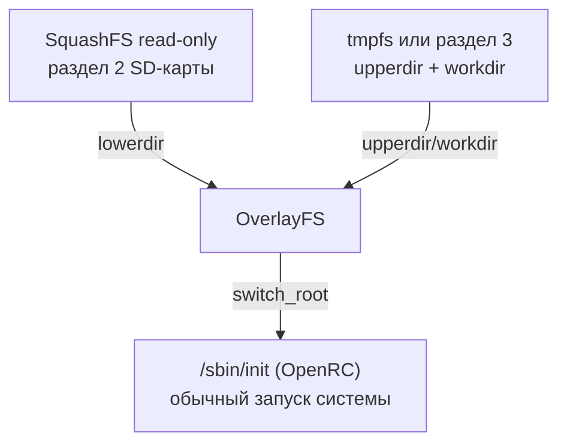

# Squashfs + OverlayFS: неизменяемый (read-only) корень для Alpine на Zynq-7010

> Дополнение к `README.md` («Сборка корневой файловой системы Alpine Linux 3.20 (armv7) для Zynq-7010»). Там, в разделе «Что дальше», был пункт «Squashfs/overlay для read-only корня — если нужна защита от порчи ФС при внезапном отключении питания» — вот эта тема полностью.

## Оглавление

1. [О документе и зачем это нужно](#1-о-документе-и-зачем-это-нужно)
2. [Общая схема](#2-общая-схема)
3. [Stateless (tmpfs) или persistent (отдельный раздел)](#3-stateless-tmpfs-или-persistent-отдельный-раздел)
4. [Необходимые опции ядра](#4-необходимые-опции-ядра)
5. [Разметка SD-карты](#5-разметка-sd-карты)
6. [Сборка SquashFS-образа из готовой rootfs](#6-сборка-squashfs-образа-из-готовой-rootfs)
7. [Кастомный initramfs](#7-кастомный-initramfs)
8. [U-Boot: загрузка initramfs](#8-u-boot-загрузка-initramfs)
9. [Первая загрузка и проверка](#9-первая-загрузка-и-проверка)
10. [Персистентность при stateless-варианте](#10-персистентность-при-stateless-варианте)
11. [Альтернатива: штатный diskless-режим Alpine](#11-альтернатива-штатный-diskless-режим-alpine)
12. [Обновление образа](#12-обновление-образа)
13. [Типичные ошибки](#13-типичные-ошибки)
14. [Источники и ссылки](#14-источники-и-ссылки)

## 1. О документе и зачем это нужно

По умолчанию README.md разворачивает rootfs на обычный ext4-раздел, доступный на запись (`root=/dev/mmcblk0p2 rw`) — это самый простой вариант, но SD-карты плохо переживают внезапное отключение питания во время записи: даже журналируемый ext4 не гарантирует целостность, если питание пропало посреди записи метаданных. Embedded-устройства обычно выключают именно так — по питанию, а не через `poweroff`.

Стандартное решение — сделать корень **read-only** через SquashFS (сжатая, в принципе доступная только для чтения ФС) и добавить сверху записываемый слой через **OverlayFS**, куда уходят все runtime-изменения. На «боевой» read-only раздел ничего не пишется напрямую — значит, ему физически нечем повредиться при обрыве питания.

## 2. Общая схема



Загрузка теперь выглядит иначе, чем в README.md: U-Boot грузит **три** файла вместо двух — ядро, dtb и **initramfs**. Initramfs собирает overlay ещё до запуска настоящего init'а и передаёт ему управление через `switch_root` — только после этого начинается обычная жизнь системы (OpenRC, сеть и т.д. из README.md §9).

## 3. Stateless (tmpfs) или persistent (отдельный раздел)

| | Вариант A: tmpfs (stateless) | Вариант B: отдельный раздел (persistent) |
|---|---|---|
| upperdir/workdir | tmpfs (RAM) | ext4 на отдельном разделе SD-карты |
| Изменения переживают перезагрузку? | Нет — при каждой загрузке система «как новая» | Да |
| Риск повреждения при обрыве питания | Практически нулевой (RAM просто исчезает, boot- и squashfs-разделы read-only) | Overlay-раздел теоретически может повредиться, но «боевая» squashfs — никогда; в худшем случае теряются только runtime-изменения, а не вся система |
| Когда уместно | Устройство не обязано помнить состояние (либо важные данные хранятся отдельно, см. раздел 10) | Нужны логи/конфиг/данные между перезагрузками |

Ниже описаны оба варианта — отличаются только тем, что именно монтируется как upperdir в скрипте `/init` (раздел 7.3).

## 4. Необходимые опции ядра

Дополнение к таблице периферии в README.md §10.5.3 — без этого overlay-схема не соберётся:

| Опция | Назначение |
|---|---|
| `CONFIG_SQUASHFS=y` | Поддержка SquashFS |
| `CONFIG_SQUASHFS_ZSTD=y` | Компрессия zstd — хороший баланс скорости распаковки и степени сжатия для Cortex-A9 (в `multi_v7_defconfig` обычно по умолчанию включена только `CONFIG_SQUASHFS_ZLIB`) |
| `CONFIG_OVERLAY_FS=y` | Поддержка OverlayFS |
| `CONFIG_BLK_DEV_INITRD=y` | Поддержка загрузки initramfs/initrd ядром — без неё загруженный initramfs будет просто проигнорирован |
| `CONFIG_DEVTMPFS=y` | Автозаполнение `/dev` в initramfs без mdev (обычно уже включено в `multi_v7_defconfig`) |

## 5. Разметка SD-карты

Новая схема (для варианта B; для A — просто нет третьего раздела):

| # | ФС | Содержимое |
|---|---|---|
| 1 | FAT32 | `BOOT.BIN`, `uImage`/`zImage`, `devicetree.dtb`, `uInitrd`, `boot.scr` |
| 2 | squashfs | боевая rootfs (read-only образ, пишется как есть, не через `mkfs`) |
| 3 (только вариант B) | ext4 | upperdir/workdir overlay (persistent) |

```bash
export SDCARD=/dev/sdX   # ЗАМЕНИТЕ на реальное устройство!

sudo parted -s "$SDCARD" mklabel msdos
sudo parted -s "$SDCARD" mkpart primary fat32 4MiB 260MiB
sudo parted -s "$SDCARD" set 1 boot on
sudo parted -s "$SDCARD" mkpart primary 260MiB 760MiB
sudo parted -s "$SDCARD" mkpart primary ext4 760MiB 100%    # только вариант B

sudo mkfs.vfat -F 32 -n BOOT "${SDCARD}1"
# раздел 2 НЕ форматируется обычным mkfs -- в него целиком заливается готовый squashfs-образ (раздел 6)
sudo mkfs.ext4 -L overlay "${SDCARD}3"   # только вариант B
```

Размер раздела 2 (в примере 500 МиБ) подбирайте по фактическому размеру `rootfs.squashfs` из раздела 6, с небольшим запасом — партицию под squashfs, в отличие от обычной ФС, потом не расширить «на лету».

## 6. Сборка SquashFS-образа из готовой rootfs

Из уже собранной по README.md (разделы 1–9) rootfs:

```bash
apk add squashfs-tools     # внутри chroot; на Debian/Ubuntu-хосте — apt-get install squashfs-tools
mksquashfs "$ROOTFS" rootfs.squashfs -comp zstd -b 256K -noappend
```

`-comp zstd` — быстрая распаковка на Cortex-A9 при хорошей степени сжатия (не забудьте `CONFIG_SQUASHFS_ZSTD=y` из раздела 4, иначе ядро не сможет смонтировать такой образ); `-b 256K` — размер блока (крупнее — чуть лучше сжатие, чуть больше RAM на кэш блоков при чтении).

Записать образ на раздел 2 — побайтово, не через обычное копирование в файловую систему:

```bash
sudo dd if=rootfs.squashfs of="${SDCARD}2" bs=4M conv=fsync status=progress
```

## 7. Кастомный initramfs

### 7.1 Компоненты

Внутри armv7-chroot (README.md §8):

```sh
apk add busybox-static
```

Точное имя файла внутри пакета отличается от дистрибутива к дистрибутиву — проверьте его прежде, чем копировать:

```sh
apk info -L busybox-static
```

### 7.2 Дерево initramfs

```bash
mkdir -p initramfs
mkdir -p initramfs/bin initramfs/proc initramfs/sys initramfs/dev
mkdir -p initramfs/mnt/lower initramfs/mnt/upper initramfs/mnt/work initramfs/mnt/newroot

cp "$ROOTFS"/bin/busybox.static initramfs/bin/busybox   # имя файла — см. 7.1
chmod +x initramfs/bin/busybox
```

### 7.3 Скрипт `/init`

```sh
cat > initramfs/init << 'EOF'
#!/bin/busybox sh
/bin/busybox --install -s /bin

mount -t proc none /proc
mount -t sysfs none /sys
mount -t devtmpfs none /dev

mount -t squashfs -o ro /dev/mmcblk0p2 /mnt/lower

# --- Вариант A: stateless (tmpfs) ---
mount -t tmpfs tmpfs /mnt/upper
# --- Вариант B: persistent -- закомментируйте строку выше и раскомментируйте эту:
# mount -t ext4 /dev/mmcblk0p3 /mnt/upper

mkdir -p /mnt/upper/data /mnt/upper/work
mount -t overlay overlay \
    -o lowerdir=/mnt/lower,upperdir=/mnt/upper/data,workdir=/mnt/upper/work \
    /mnt/newroot

exec switch_root /mnt/newroot /sbin/init
EOF
chmod +x initramfs/init
```

`switch_root` (апплет busybox) должен вызываться именно из initramfs — это отдельная временная rootfs-в-RAM, которую ядро распаковывает по указанию бутлоадера ещё до монтирования настоящего корня.

### 7.4 Упаковка и обёртка под U-Boot

```bash
cd initramfs
find . | cpio -o -H newc | gzip -9 > ../initramfs.cpio.gz
cd ..
mkimage -A arm -O linux -T ramdisk -C gzip -d initramfs.cpio.gz uInitrd
```

## 8. U-Boot: загрузка initramfs

Копируем `uInitrd` на boot-раздел вместе с остальным (README.md §11), меняем сценарий загрузки (README.md §12):

```
fatload mmc 0 0x03000000 uImage
fatload mmc 0 0x02A00000 devicetree.dtb
fatload mmc 0 0x04000000 uInitrd
setenv bootargs console=ttyPS0,115200
bootm 0x03000000 0x04000000 0x02A00000
```

Ключевое отличие от README.md §12: вместо `-` (нет ramdisk) теперь реальный адрес `uInitrd`, а в `bootargs` **не нужны** `root=`/`rootwait` — какой раздел монтировать как корень теперь решает сам initramfs (раздел 7.3), а не ядро напрямую через `root=`.

## 9. Первая загрузка и проверка

После входа стоит убедиться, что корень действительно overlay:

```sh
mount | grep -E 'overlay| / '
```

Ожидаемая строка — что-то вроде `overlay on / type overlay (rw,...,lowerdir=/mnt/lower,upperdir=...)`.

Проверка устойчивости к обрыву питания: создайте файл, `sync`, обесточьте плату (не через `poweroff`!) во время какой-нибудь фоновой записи, включите заново — при варианте A файл исчезнет (это и есть цель: система гарантированно грузится «как новая»), при варианте B должен сохраниться, а сам корень в любом случае останется исправным в обоих вариантах.

## 10. Персистентность при stateless-варианте

Полностью stateless-система обычно всё равно не может позволить себе терять абсолютно всё (ключи SSH-хоста, накопленные данные приложения). Практичный подход — держать *отдельные* пути на persistent-хранилище через bind mount поверх уже собранного overlay, ещё до запуска основных сервисов:

```sh
mount /dev/mmcblk0p3 /mnt/data
mkdir -p /mnt/data/var-lib-myapp
mount --bind /mnt/data/var-lib-myapp /var/lib/myapp
```

Такой bind mount можно сделать отдельным ранним OpenRC-сервисом (по образцу README.md §15.8) — тогда для приложения путь `/var/lib/myapp` выглядит как обычная директория, но физически она на persistent-разделе, а всё остальное дерева `/` при перезагрузке сбрасывается.

## 11. Альтернатива: штатный diskless-режим Alpine

У Alpine есть собственный, «из коробки», механизм именно для этого паттерна — **diskless mode**: `mkinitfs` собирает initramfs с поддержкой поиска/распаковки образов, а `lbu` (Local Backup Utility) сохраняет и восстанавливает изменения `/etc` (и других отмеченных путей) через архив `*.apkovl.tar.gz`, который автоматически ищется и применяется при каждой загрузке (`lbu include /path`, `lbu commit`).

Изначально рассчитан на ISO/USB-загрузку (тот же механизм используют официальные Live-образы Alpine), но применялся и для SBC — есть готовые проекты вроде `alpine-diskless-headless` (Raspberry Pi, Rock Pro 64), использующие тот же приём сборки через qemu+chroot с x86_64-хоста, что и весь README.md.

Плюсы: меньше кода писать самому, `lbu` — готовый документированный интерфейс для персистентности конфигурации. Минусы: рассчитан прежде всего на «стандартную» загрузку (initramfs ищет корень по метке/UUID через собственный `nlplug-findfs`, ожидает определённую раскладку) — под кастомный U-Boot-стенд его придётся адаптировать, а у механизма репутация «многих подвижных частей» (найти apkovl, применить, домонтировать по новому fstab, доустановить пакеты, продолжить загрузку). Часть опытных пользователей Alpine в продакшене в итоге пишут свой минимальный init, как в разделах 6–8 этого документа, именно ради предсказуемости.

Для знакомства с механизмом живьём — на «обычном» (не Zynq/U-Boot) железе `setup-alpine` с ответом `disk=none` включает diskless-режим со всеми штатными скриптами.

## 12. Обновление образа

Поменяли что-то в rootfs (README.md §9) или добавили свой пакет (`PACKAGING.md`) — пересоберите squashfs и перезалейте раздел 2 (разделы 6–7 этого документа заново). Initramfs пересобирать нужно только при изменении самой логики overlay/разметки разделов, а не при обычных обновлениях содержимого rootfs.

## 13. Типичные ошибки

| Ошибка | Причина | Решение |
|---|---|---|
| `VFS: Cannot open root device` / initramfs не запускается вовсе | Забыт `CONFIG_BLK_DEV_INITRD=y`, либо `uInitrd` не указан в `bootm`/`bootz` | Раздел 4 (конфиг ядра), раздел 8 (адрес в `bootm`) |
| `mount: mounting /dev/mmcblk0p2 on /mnt/lower failed: Invalid argument` | `CONFIG_SQUASHFS`/`CONFIG_SQUASHFS_ZSTD` не собраны в ядро, либо раздел 2 не содержит squashfs-образ | Раздел 4; проверить, что раздел 2 действительно залит образом (раздел 6) |
| `switch_root: failed to mount moving /mnt/newroot to /: Invalid argument` | `mount -t overlay` не отработал (упал раньше по цепочке), либо скрипт запускается не из initramfs | Проверить каждую строку `/init` по отдельности (раздел 7.3); `switch_root` работает только из initramfs |
| Изменения пропадают при варианте B (должны сохраняться) | В `/init` активна строка `mount -t tmpfs` вместо `mount -t ext4 /dev/mmcblk0p3` | Раздел 7.3 — раскомментировать нужный вариант |
| `Kernel panic - not syncing: Attempted to kill init` сразу после `switch_root` | В squashfs нет `/sbin/init` — скорее всего, в `mksquashfs` (раздел 6) попал не тот каталог | Проверить содержимое `$ROOTFS` перед сборкой образа |
| `apk add` и обычная работа с пакетами не работают | Read-only тут ни при чём — overlay сам по себе полностью доступен на запись; ищите обычные причины (сеть, репозитории) как в README.md §16 | — |

## 14. Источники и ссылки

- Kernel docs — Overlay Filesystem: https://docs.kernel.org/filesystems/overlayfs.html
- SquashFS-tools (исходники, документация по опциям mksquashfs): https://github.com/plougher/squashfs-tools
- Alpine Wiki — Diskless Mode: https://wiki.alpinelinux.org/wiki/Diskless_Mode
- alpine-conf (реализация `lbu`, `setup-alpine`): https://github.com/alpinelinux/alpine-conf
- mkinitfs — генератор initramfs Alpine: https://github.com/alpinelinux/mkinitfs
- Пример адаптации diskless-режима под SBC: https://github.com/vincentserpoul/alpine-diskless-headless
